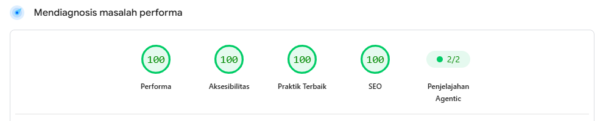

<div align="center">

# 🌐 Andre Wahyu Hermawan — Personal Website & Portfolio

**Modern, Ultra-Fast Personal Portfolio & Blog built with Astro 5, Tailwind CSS, and Decap CMS.**

[](https://andrean-lp.github.io/)
[](https://pagespeed.web.dev/analysis/https-andrean-lp-github-io/lbagbnf1gk?hl=id&form_factor=mobile)
[](https://github.com/andrean-lp/andrean-lp.github.io/actions)
[](LICENSE)

[🌐 Kunjungi Website](https://andrean-lp.github.io/) • [⚡ Cek Audit PageSpeed (100/100)](https://pagespeed.web.dev/analysis/https-andrean-lp-github-io/lbagbnf1gk?hl=id&form_factor=mobile) • [💼 LinkedIn](https://www.linkedin.com/in/andrean-lp) • [💬 Kontak WhatsApp](https://wa.me/6285187437036)

</div>

---

## ⚡ Social Proof & Performa: 100/100 Google PageSpeed Insights

Website ini dioptimasi secara presisi dengan arsitektur static generation **Astro 5** (*Zero-JS runtime*), meraih skor sempurna **100/100** di seluruh metrik utama Google PageSpeed Insights (Mobile): **Performa**, **Aksesibilitas**, **Praktik Terbaik**, dan **SEO**.

<div align="center">
  <a href="https://pagespeed.web.dev/analysis/https-andrean-lp-github-io/lbagbnf1gk?hl=id&form_factor=mobile" target="_blank" rel="noopener noreferrer">
    
  </a>
  <br /><br />
  <a href="https://pagespeed.web.dev/analysis/https-andrean-lp-github-io/lbagbnf1gk?hl=id&form_factor=mobile" target="_blank" rel="noopener noreferrer">
    
  </a>
  <br />
  <sub>👆 Klik gambar atau tombol di atas untuk membuka laporan hasil audit resmi Google secara langsung.</sub>
</div>

---

## 👤 Tentang Saya

Halo! Saya **Andre Wahyu Hermawan** (*Landing Page Strategist*). Website ini merupakan rumah digital saya untuk menampilkan hasil karya portofolio, membagikan artikel seputar pengembangan web dan digital marketing, serta mengelola seluruh konten secara dinamis melalui Decap CMS berbasis Git.

---

## ✨ Fitur Utama Website

* ⚡ **Performa Kilat (100/100 Lighthouse)**: Didukung oleh arsitektur static generation **Astro 5** dengan zero-JS runtime secara default.
* 🌗 **Dukungan Dark & Light Mode**: Transisi tema warna halus dan nyaman di mata dengan penyimpanan preferensi otomatis.
* 💼 **Showcase Studi Kasus (Side Projects)**:
  * Kartu interaktif di beranda dengan ringkasan *Problem*, *Solution*, dan *Impact*.
  * Halaman detail studi kasus komprehensif (`/side-projects/[slug]/`) dengan tata letak modern terinspirasi oleh studi kasus kelas dunia.
* 📁 **Katalog Client Projects**: Daftar proyek klien profesional lengkap dengan tag teknologi dan tautan live demo.
* 📝 **Blog & Artikel Dinamis**:
  * Mendukung Markdown (`.md`) dan MDX (`.mdx`).
  * Table of Contents (Daftar Isi) interaktif dengan Scrollspy.
  * Sistem tagging / kategori artikel yang terorganisir.
  * Komentar interaktif berbasis GitHub Discussions via Giscus.
* 🛠️ **Git-based Content Management (Decap CMS)**:
  * Pengelolaan visual tanpa kode untuk artikel, proyek, biodata profil, dan pengaturan web secara privat dan aman.
  * **Sistem Pembersihan Media Otomatis**: Menghapus gambar cover lama secara cerdas saat artikel dihapus atau favicon diperbarui untuk menghemat storage.
* 🔍 **Optimasi SEO, AEO & GEO**:
  * Schema.org JSON-LD lengkap (`WebSite`, `Person`, `BlogPosting`, `CreativeWork`, `BreadcrumbList`).
  * OpenGraph & Twitter Card teroptimasi untuk pratinjau media sosial.
  * Sitemap XML otomatis dan RSS Feed (`/rss.xml`).
* 💬 **Widget WhatsApp Melayang**: Tombol chat langsung yang adaptif muncul otomatis saat pengunjung menjelajahi halaman.

---

## 🛠️ Tech Stack & Ekosistem

| Lapisan | Teknologi |
| :--- | :--- |
| **Framework** | [Astro v5](https://astro.build/) |
| **Styling** | [Tailwind CSS](https://tailwindcss.com/) & Tailwind Typography |
| **Content Management** | [Decap CMS](https://decapcms.org/) (Git-based CMS) |
| **Bahasa** | [TypeScript](https://www.typescriptlang.org/) & HTML5 |
| **Komentar** | [Giscus](https://giscus.app/) (GitHub Discussions) |
| **Hosting & CI/CD** | [GitHub Pages](https://pages.github.com/) via GitHub Actions |

---

## 📂 Struktur Direktori Project

```text
├── public/
│   ├── images/              # Media dan gambar hasil upload CMS
│   ├── favicon.ico
│   ├── robots.txt
│   └── site.webmanifest
├── src/
│   ├── assets/              # Aset statis & foto profil
│   ├── components/          # Komponen Astro (Header, Footer, Projects, dll.)
│   ├── content/             # Koleksi konten blog (Markdown & MDX)
│   ├── data/                # Data JSON terstruktur (Profil, Proyek, Pengaturan)
│   │   ├── featured_case_study.json
│   │   ├── profile.json
│   │   ├── projects.json
│   │   └── site.json
│   ├── layouts/             # Template layout (BaseLayout, BaseHead)
│   ├── pages/               # Routing halaman website
│   │   ├── side-projects/   # Halaman dinamis [slug].astro untuk Side Project
│   │   ├── posts/           # Indeks artikel
│   │   ├── projects/        # Indeks proyek klien
│   │   ├── tags/            # Kategori tag
│   │   └── index.astro      # Beranda utama
│   └── styles/              # Global styles & Tailwind
├── scripts/                 # Otomatisasi pembersihan media & optimasi gambar
├── astro.config.mjs         # Konfigurasi Astro framework
├── tailwind.config.mjs      # Konfigurasi Tailwind CSS
└── package.json
```

---

## 💻 Panduan Menjalankan di Lokal (Local Development)

### Prasyarat
* **Node.js**: Versi 20 atau lebih baru
* **PNPM** atau **NPM**

### Langkah Instalasi
1. Clone repository ini:
   ```bash
   git clone https://github.com/andrean-lp/andrean-lp.github.io.git
   cd andrean-lp.github.io
   ```

2. Install dependensi:
   ```bash
   pnpm install
   # atau
   npm install
   ```

3. Jalankan server lokal:
   ```bash
   pnpm run dev
   # atau
   npm run dev
   ```
   Buka browser di `http://localhost:4321` untuk melihat website.

4. Build untuk produksi:
   ```bash
   pnpm run build
   # atau
   npm run build
   ```

---

## 🚀 Deployment

Website ini menggunakan alur otomatisasi penuh **GitHub Actions**. Setiap kali ada perubahan (commit) yang di-push ke branch `main`, workflow `.github/workflows/deploy.yml` akan otomatis:
1. Menjalankan skrip pembersihan media & optimasi aset.
2. Memvalidasi kode (`astro check`).
3. Mem-build website statis (`astro build`).
4. Mempublikasikannya langsung ke **GitHub Pages**.

---

## 📬 Hubungi Saya

Tertarik untuk berkolaborasi atau membutuhkan pembuatan landing page & website profesional?
* 🌐 **Website**: [andrean-lp.github.io](https://andrean-lp.github.io/)
* 💼 **LinkedIn**: [linkedin.com/in/andrean-lp](https://www.linkedin.com/in/andrean-lp)
* 💬 **WhatsApp**: [+62 851-8743-7036](https://wa.me/6285187437036)
* 🐙 **GitHub**: [@andrean-lp](https://github.com/andrean-lp)
* 📸 **Instagram**: [@andrean.lp](https://www.instagram.com/andrean.lp)

---

<div align="center">
  <sub>© 2026 Andre Wahyu Hermawan. Dibuat dengan dedikasi menggunakan Astro & Tailwind CSS.</sub>
</div>